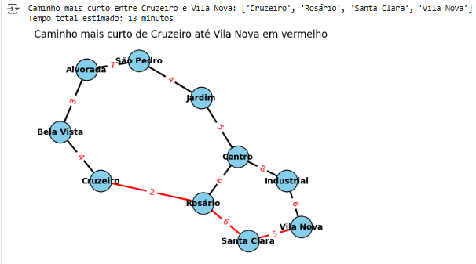
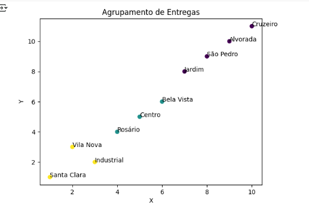

# -Artificial-Intelligence-Fundamentals
       🎯 Desafio
A empresa fictícia Sabor Express enfrenta dificuldades para organizar suas entregas em horários de pico, resultando em:
Rotas ineficientes;
Maior tempo de entrega;
Aumento de custos com combustível;
Insatisfação dos clientes.

  ** O objetivo deste projeto é aplicar Inteligência Artificial para sugerir rotas mais rápidas e eficientes, além de agrupar entregas próximas.

 📌  Objetivos da Solução

Representar a cidade como um grafo, com bairros como nós e ruas como arestas (com pesos de distância/tempo).
Implementar algoritmos de busca para encontrar o caminho mais curto entre bairros (usando A*).
Utilizar K-Means para agrupar bairros próximos em zonas de entrega.
Comparar eficiência das soluções e discutir limitações e melhorias.

📌 Algoritmos Utilizados

A*: busca heurística para encontrar o caminho mais curto no grafo.
K-Means: aprendizado não supervisionado para agrupar bairros próximos.
Silhouette Score: métrica para avaliar a qualidade dos agrupamentos.

📌 Modelo e Grafo da Cidade

O grafo foi criado considerando 10 bairros fictícios conectados por ruas com tempos de deslocamento estimados.

Exemplo de conexões:
Centro ↔ Jardim (5 min)
Jardim ↔ São Pedro (4 min)
Cruzeiro ↔ Bela Vista (4 min)

 ** O código gera automaticamente o grafo e o caminho mais curto.

  📌 Clustering (K-Means)

Os bairros foram posicionados em um plano (x,y) e agrupados em 3 clusters.
Cada cluster representa uma zona de entrega, otimizando o trabalho dos entregadores.

 **Silhouette Score obtido: ~0.45 (boa separação entre clusters).

 📌📌 Resultados

O algoritmo A* encontra automaticamente o caminho mais curto entre qualquer par de bairros.

O K-Means conseguiu separar os bairros em 3 regiões, reduzindo o deslocamento total.

A solução mostra ganhos de eficiência e pode ser expandida para cenários reais.

 📌📌 Melhorias Futuras
Esse projeto pode ser melhorado de várias formas. Algumas ideias que pensei:
- Usar mapas reais pra deixar o modelo mais próximo da realidade
- Considerar horários de pico, já que o trânsito muda bastante dependendo da hora
- Criar rotas com várias entregas no mesmo trajeto, como acontece de verdade
- Fazer uma interface mais visual, tipo um painel com os bairros e rotas
- Testar outros algoritmos além do A*, pra ver se algum é mais rápido ou eficiente
- Simular situações como obras ou ruas bloqueadas, pra deixar o sistema mais flexível
- Usar dados de clientes pra ajustar as rotas com base na satisfação ou tempo de entrega

